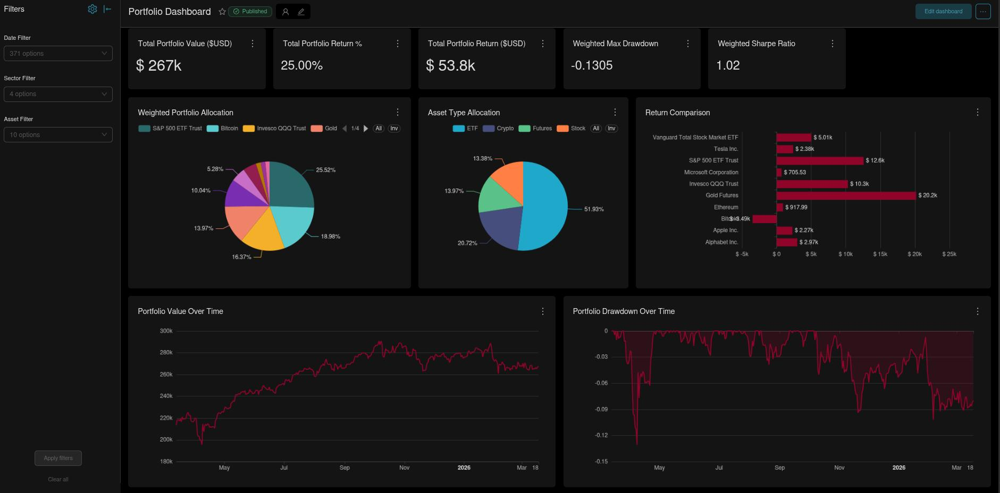
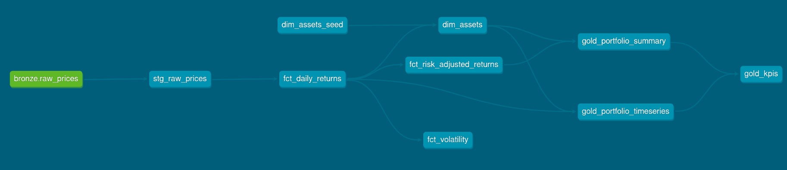

An end-to-end data pipeline that collects financial market data, transforms it into meaningful portfolio metrics, and surfaces actionable insights through an interactive dashboard — built entirely with production-grade open-source tools.

### What is this project?
## Turning raw market data into portfolio intelligence

Investment firms, family offices, and fintech companies all face the same challenge: financial data arrives in messy, fragmented formats and needs to be cleaned, structured, and enriched before anyone can make sense of it. This project demonstrates exactly that workflow — from raw price ingestion all the way to a polished, interactive dashboard with key portfolio performance metrics.

The pipeline tracks a **multi-asset portfolio** spanning stocks, ETFs, cryptocurrencies, gold futures, and more — computing daily returns, volatility, Sharpe ratios, and drawdown metrics automatically, then presenting them in a live dashboard that filters by date, sector, and asset.

### How it works
## A pipeline with four clear stages
Each stage has a single responsibility and hands off clean, well-structured data to the next — the same design principle used in professional data engineering teams.
#### Stage 1 — Data Ingestion

A Python script pulls historical and live price data from **Yahoo Finance** via the `yfinance` library, then loads it directly into a PostgreSQL database as a raw "bronze" table. This is the entry point: no transformation happens here, just reliable collection and storage.
#### Stage 2 — Storage

**PostgreSQL** holds both the raw prices and all the transformed analytical models. It acts as the single source of truth — every downstream tool reads from it. Running inside Docker means the database is fully portable and reproducible across any environment.
#### Stage 3 — Transformation (dbt)

Raw prices pass through a chain of **dbt models**: staging cleans and standardizes the data, fact tables compute daily returns and volatility, and gold-layer tables produce the final aggregated metrics — portfolio summaries, time-series values, and risk-adjusted KPIs. Every transformation is version-controlled, documented, and automatically tested.

####  Stage 4 — Visualisation

**Apache Superset** connects directly to PostgreSQL and renders the gold-layer data into an interactive dashboard — allocation pie charts, return comparisons, drawdown curves, and top-level KPI cards. Filters for date, sector, and individual asset let stakeholders slice the data without any technical knowledge.

### Technology choices
## Why these specific tools?
Every tool in this stack was chosen because it reflects what production data teams actually use — not toy libraries, but battle-tested open-source software that appears in job descriptions across the industry.

- #### dbt (data build tool) - Transformation with engineering discipline
	dbt brings software development practices — version control, unit testing, documentation, and modularity — to SQL transformations. It eliminates the "spaghetti SQL" problem common in analytics teams and makes every data model traceable and auditable. The lineage graph (visible in the project) shows exactly which models depend on which, making debugging trivial.
	
- #### PostgreSQL - Reliable, production-grade storage
	PostgreSQL is the world's most advanced open-source relational database. For a financial analytics pipeline where data consistency and query reliability are non-negotiable, it was the natural fit. It also integrates seamlessly with both dbt and Superset out of the box.
	
- #### Apache Superset - Business-facing dashboards without BI licensing costs
	Superset is an enterprise-grade business intelligence platform used by companies like Airbnb, Twitter, and Nielsen. It lets non-technical stakeholders explore data through charts and filters without writing a single line of SQL — making insights genuinely accessible across a team.
	
- #### Docker Compose - Portable, reproducible environments
	The entire stack — PostgreSQL, dbt, and Superset — runs in containers orchestrated by Docker Compose. This means the project can be cloned and running on any machine in minutes, and the same setup can be deployed to AWS EC2 (documented in the README) with identical commands. No "works on my machine" problems.
	
- #### Python + yfinance - Automated, free-tier market data
    Rather than paying for a commercial market data feed, this pipeline uses Yahoo Finance's unofficial API via the `yfinance` Python library. The ingestion script is parameterised to handle multiple tickers, date ranges, and asset types — making it straightforward to extend the portfolio coverage.

### Business context
## Where this pipeline fits in the real world
The patterns demonstrated here map directly to problems solved daily at financial institutions, investment platforms, and data-driven businesses of all sizes.

- #### Investment Management Firms
    Portfolio managers need daily performance reports, risk metrics, and attribution analysis. A pipeline like this automates that reporting layer, replacing manual spreadsheet work that's error-prone and time-consuming.
- #### Fintech & Wealth Platforms
	Consumer investment apps need to compute and display returns, risk scores, and asset allocations in real time. The dbt transformation models here are the kind of logic that sits behind those user-facing numbers.
- #### Corporate Treasury Teams
	Companies that hold cash or assets across currencies and instruments need consolidated views of their positions and risk exposure — exactly what this dashboard's aggregation layer provides.
- #### Data & Analytics Teams
	Any team replacing ad-hoc SQL scripts or disconnected spreadsheets with a governed, version-controlled transformation layer faces the same architecture decisions solved here: staging → facts → aggregates → BI tool.
### Go deeper
## Full technical documentation on GitHub
This page is an overview for understanding the project's purpose and scope. The GitHub repository contains the complete technical documentation: setup instructions, Docker configuration, dbt model descriptions, database schemas, deployment guide for AWS EC2, and all source code.